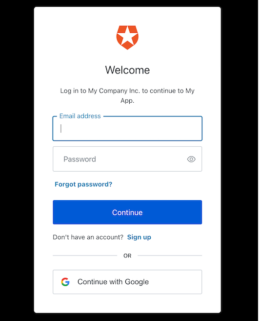

# Implementing SSO using Auth0 in ReactJS

- [Implementing SSO using Auth0 in ReactJS](#implementing-sso-using-auth0-in-reactjs)
  - [Introduction](#introduction)
  - [What is Auth0](#what-is-auth0)
  - [Why implement Auth0](#why-implement-auth0)
  - [How to implement SSO with Auth0 in ReactJS?](#how-to-implement-sso-with-auth0-in-reactjs)
    - [Setting up Auth0](#setting-up-auth0)
    - [Configuration](#configuration)
    - [Integration](#integration)
  - [Why we shouldn't implement SSO using Auth0](#why-we-shouldnt-implement-sso-using-auth0)
  - [Conclusion](#conclusion)
  - [References](#references)


## Introduction
This research paper provides a step-by-step guide on implementing Auth0 authentication and authorization (SSO) in a ReactJS application. It covers the installation and configuration process, as well as the implementation of fundamental functions such as login and logout, and retrieving user information. 

Single Sign-On (SSO) is a crucial aspect of modern web applications, providing a seamless user experience and enhanced security. Auth0 is a popular identity and access management platform that simplifies the implementation of SSO in applications. This research paper aims to guide developers in implementing Auth0 SSO in a ReactJS application.

## What is Auth0

Auth0 is a comprehensive identity management platform that simplifies the implementation of authentication and authorization features in web and mobile applications. It acts as a centralized identity provider, enabling users to log in to multiple applications with a single set of credentials, a concept known as single sign-on (SSO). 

Auth0 offers the following benefits:
- Easy Integration: Auth0 seamlessly integrates with various technologies, including ReactJS, allowing developers to add authentication features without extensive coding.

- Enhanced User Experience: Auth0 enables SSO, allowing users to authenticate once and access multiple applications without the need for repetitive logins, improving convenience and user experience.

- Security and Compliance: Auth0 handles authentication flows, token generation, and session management, ensuring secure user authentication and safeguarding sensitive user data. It also offers multi-factor authentication and integrates with external identity providers.

- Scalability and Customization: Auth0 caters to applications of different sizes and requirements. It provides scalability, allowing for a growing user base, and offers customization options to tailor authentication flows and branding to match the application's needs.

## Why implement Auth0
Implementing SSO in ReactJS applications offers several benefits. 

Firstly, it enhances the user experience by allowing seamless authentication across multiple applications. Users can log in once and access all authorized resources without the hassle of remembering and entering credentials repeatedly. Additionally, Auth0 provides robust security measures, ensuring that user identities are protected and authentication is performed securely.

Auth0 also offers scalability and flexibility, accommodating the growing needs of applications with varying user bases. It supports various identity protocols, making it compatible with different authentication requirements. By leveraging Auth0 for SSO in ReactJS applications, developers can save time and effort by integrating a reliable and feature-rich authentication solution.

## How to implement SSO with Auth0 in ReactJS?

### Setting up Auth0
To begin, the developer needs to create a tenant on the Auth0 platform. 


<br>

Once the tenant is created, an application specifically for ReactJS must be set up. 

You need to go to the application tab where you are going to create the application itself. 

The developer should choose the "Single Page Web Applications" option, as ReactJS falls under this category.


### Configuration

When a new application is created, you will need some details about application that are going to allow you to communicate between your ReactJS application and Auth0.
Those details could be found at the *Application Settings* section in the Auth0 dashboard.
You need the following information:
- Domain
- Client ID 
  
<br>


Next thing that needs to be done is configurating *Callback URLs*. Set up callback URLs to handle authentication redirects. These URLs determine where Auth0 redirects the user after successful authentication, logout, or other scenarios. You typically need to specify the **Allowed Callback URLs**, **Allowed Logout URLs**, and **Allowed Web Origins**. For a ReactJS application running locally, the default value for these URLs is usually `http://localhost:3000`.

### Integration

After we set up congfigurations, we need to integrate them with our React application.
First we need to run the command within our project directory to install the Auth0 React SDK:

`npm install @auth0/auth0-react`

With SDK we can use components and hooks that Auth0 provides to help us implement SSO faster and more efficient

To make our application use Auth0 React SDK we need to integrate Auth0. We are going to do that with wrapping our root component `index.js` with **Auth0Provider** that we need to import from the SDK that we install earlier. 
Snippet how your `index.js` needs to look like.

```
import React from 'react';
import { createRoot } from 'react-dom/client';
import { Auth0Provider } from '@auth0/auth0-react';
import App from './App';
import config from '../auth0-config';

const root = createRoot(document.getElementById('root'));

root.render(
<Auth0Provider
    domain="{config.clientId}"
    clientId="{config.domain}"
    authorizationParams={{
      redirect_uri: window.location.origin
    }}
  >
    <App />
  </Auth0Provider>,
);
```
As we see Auth0Provider asks for three props
- Domain
- ClientID
- AuthorizationParams ( The URL to where you'd like to redirect your users after they authenticate with Auth0.)

We earlier mentioned Domain and ClientID when we were configuration our application in the application settings. 

My suggestion is to make separate file in your root folder `auth0-config-js` (you can name it how ever you want) where you will set the needed props.

```
const config = {
    clientId: "YOUR_CLIENT_ID",
    domain: "YOUR_DOMAIN"
  };
  
  export default config;
```
Now that we have configured Auth0Provider, Auth0 is successfully integrated and we are able to use Auth0 hooks in our application.

To make this complete we need to implement Login/Logout.

In **src** directory make another one thats called Components. There we are going to make Login and Logout components which are we going to use in our application.

As we saw earlier the Auth0 React SDK gives us tools to quickly implement user authentication in our React application, with `using loginWithRedirect()` method from the `useAuth0()` hook.

Executing `loginWithRedirect()` redirects your users to the Auth0 Universal Login Page, where Auth0 can authenticate them. Upon successful authentication, Auth0 will redirect your users back to your application.

```
import React from "react";
import { useAuth0 } from "@auth0/auth0-react";

const LoginButton = () => {
  const { loginWithRedirect } = useAuth0();

  return <button onClick={() => loginWithRedirect()}>Log In</button>;
};

export default LoginButton;
```

Add the `LoginButton` component to your application and verify that your React application redirects you ro the Auth0 Universal Login.



Once that's complete, verify that Auth0 redirects you to your application using the value of the `authorizationParams.redirect_uri` that you used to configure the `Auth0Provider`.

Now that you can login, it would be logical have a way to logout, right?

As we make `Login` component we need to implement `Logout` component that is going to use `logout()` method from `useAuth0()` hook. Executing logout() redirects your users to your Auth0 logout endpoint (https://YOUR_DOMAIN/v2/logout) and then immediately redirects them to your application.

```
import React from "react";
import { useAuth0 } from "@auth0/auth0-react";

const LogoutButton = () => {
  const { logout } = useAuth0();

  return (
    <button onClick={() => logout({ logoutParams: { returnTo: window.location.origin } })}>
      Log Out
    </button>
  );
};

export default LogoutButton;
```
Add the LogoutButton component to your application. When you click it, verify that your React application redirects you the address you specified as one of the "Allowed Logout URLs" in the "Settings" and that you are no longer logged in to your application.

You have implemented your first SSO with the Auth0 in your application

The Auth0 React SDK also provides the profile information associated with logged-in users quickly in whatever component you need. If you want to access user information you need to use `user` property exposed by the useAuth0() hook.

You can make new `Profile` component where you are going to display user's information.
```
import React from "react";
import { useAuth0 } from "@auth0/auth0-react";

const Profile = () => {
  const { user, isAuthenticated, isLoading } = useAuth0();

  if (isLoading) {
    return <div>Loading ...</div>;
  }

  return (
    isAuthenticated && (
      <div>
        
        <h2>{user.name}</h2>
        <p>{user.email}</p>
      </div>
    )
  );
};

export default Profile;
```

The user property contains sensitive information and artifacts related to the user's identity. As such, its availability depends on the user's authentication status. To prevent any render errors, use the isAuthenticated property from useAuth0() to check if Auth0 has authenticated the user before React renders any component that consumes the user property. Ensure that the SDK has completed loading before accessing the isAuthenticated property, by checking that isLoading is false.

## Why we shouldn't implement SSO using Auth0
While implementing single sign-on (SSO) using Auth0 in a ReactJS application offers numerous benefits, there are a few considerations that might lead to a decision against its implementation. Firstly, the additional complexity and learning curve involved in integrating Auth0 may not be justified for small-scale applications with limited user bases. Secondly, if the application primarily relies on internal or proprietary authentication systems that cannot be easily integrated with Auth0, it may be more efficient to continue using the existing authentication infrastructure. Lastly, if the application does not handle sensitive user data or requires minimal authentication functionality, implementing SSO with Auth0 might introduce unnecessary overhead and dependencies. Ultimately, the decision of whether or not to implement Auth0 for SSO in a ReactJS application should be based on the specific needs, resources, and constraints of the project.

## Conclusion
This research paper presented a comprehensive guide on implementing single sign-on (SSO) using Auth0 in a ReactJS application. Auth0 offers seamless integration, enhanced user experience, robust security measures, and scalability. The step-by-step process involved setting up a tenant and configuring the application in the Auth0 platform, integrating Auth0 into the React application using the Auth0 React SDK, implementing login and logout functionalities, and accessing user information. By following this guide, developers can successfully implement SSO, providing a convenient and secure authentication experience for users in their ReactJS applications.
## References

> Auth0-quickstart-react: https://auth0.com/docs/quickstart/spa/react?framed=1&sq=1#configure-auth0
