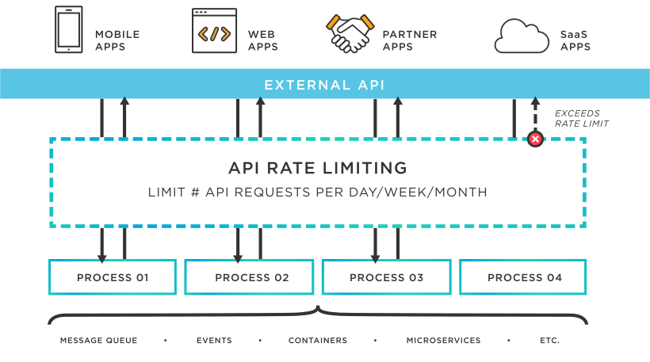
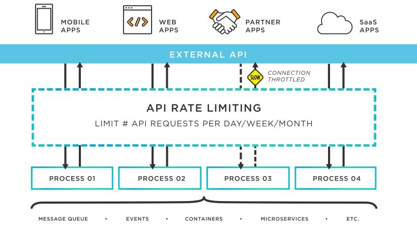

# Ensuring API Security: Rate Limiting and Throttling

- [Ensuring API Security: Rate Limiting and Throttling](#ensuring-api-security-rate-limiting-and-throttling)
  - [Introduction](#introduction)
  - [What is Rate Limiting and Throttling?](#what-is-rate-limiting-and-throttling)
    - [1. What is Rate Limiting?](#1-what-is-rate-limiting)
    - [2. What is Throttling?](#2-what-is-throttling)
  - [Why Implement Rate Limiting and Throttling?](#why-implement-rate-limiting-and-throttling)
  - [Why not implement Rate Limiting and Throttling](#why-not-implement-rate-limiting-and-throttling)
  - [Possible alternatives to Rate Limiting and Throttling](#possible-alternatives-to-rate-limiting-and-throttling)
  - [Conclusion](#conclusion)
  - [References](#references)

## Introduction
This research document focuses on rate limiting and throttling as essential techniques for maintaining API security and preventing abuse or overload. 
 

Even with security measures in place, there has been a significant surge of 681% in malicious API attacks in 2021. It is predicted that these attacks will become the primary method of exploitation in 2022. To strengthen your security measures, it is essential to focus on enhancing your API management. Two important aspects of API management are API throttling and rate-limiting. 
 

## What is Rate Limiting and Throttling?

Rate limiting and throttling are mechanisms used to control the frequency and volume of requests made to an API. These techniques ensure fair usage, prevent abuse, and protect the API server from excessive load.

### 1. What is Rate Limiting?

In order to prevent abuse or misuse of the API, ensure equal distribution of resources, prevent DDoS attacks, and maintain peak performance, rate limiting is an essential tool in API management. In order to limit usage, stop malicious activity, and protect the API's resources, it places limits on the frequency of incoming requests. Rate limiting prevents API overloading by enforcing these limits, maintains availability for all users, and reduces the impact of DDoS attacks. Additionally, it enables the API to manage times of high demand without suffering performance degradation. Overall, rate limiting is an essential component of managing and securing APIs, balancing accessibility and security.

<!-- Rate limiting sets restrictions on the number of requests a client or user can make within a specific time frame. It helps maintain optimal resource allocation, performance, and availability of the API. -->

For Rate Limiting to work you need to specify following parameters:
- **Number of requests**: user allowed to send until the rate limit is reached
- **Time period**: specify the time period allowed per request

*Rate Limiting diagram [[1]](#rate-limiting-diagram)*

### 2. What is Throttling?

Throttling in API management involves controlling the rate of requests made to an API server to prevent overload and ensure optimal performance. It can be achieved through mechanisms such as regulating request frequency, introducing delays between requests, and using algorithms like the token-bucket algorithm. Throttling helps manage traffic bursts, prevent abuse, and maintain fair resource distribution. By implementing throttling, API providers can strike a balance between meeting visitor needs and ensuring server stability.

*Throttling diagram [[2]](https://www.tibco.com/sites/tibco/files/media_entity/2021-04/api-throttling-diagram.svg)*

## Why Implement Rate Limiting and Throttling?

By implementing rate limiting and throttling, organizations can effectively manage and control API usage, ensure resources, enhance security, and provide a reliable and high-performing API experience for their users.

- **Preventing Abuse:** Rate limiting and throttling deter malicious users or automated scripts from overwhelming the API with excessive requests.
- **Resource Protection:** By controlling request volumes, APIs ensure fair distribution of resources among clients and protect their servers from being overwhelmed.
- **Reducing DDoS Attacks:** Rate limiting and throttling can help reduce the impact of ***Distributed Denial-of-Service (DDoS)*** [[3]](#ddos) attacks by limiting request rates.
- **Optimal Performance:** By maintaining a consistent level of service, rate limiting and throttling ensure that API performance remains stable, even during high-demand periods.

## Why not implement Rate Limiting and Throttling

While rate limiting and throttling can provide several benefits to API management, there are also considerations for why they may not be implemented in certain scenarios:

- **Inflexibility:** Strict limits may hinder legitimate users or applications that require higher request volumes, potentially impacting user experience.
- **Compatibility Issues:** Legacy systems or older client applications may not support rate limiting or throttling mechanisms, leading to compatibility challenges.
- **Increased Complexity:** Implementing and managing rate limiting and throttling features adds complexity to the API infrastructure, requiring resources and expertise.
- **Limited Visibility:** Rate limiting and throttling can obscure usage patterns, making it difficult to gather accurate analytics and optimize API performance.
- **Potential False Positives:** Predefined thresholds and algorithms may generate false positives, mistakenly blocking legitimate users or applications.

Before implementing rate limiting and throttling, organizations should carefully consider their specific requirements, user needs, and technical constraints to strike a balance between security and user experience.

## Possible alternatives to Rate Limiting and Throttling

There are several possible alternatives to rate limiting and throttling in API management. These alternatives include:

- **Request quotas:** Set a maximum limit on the total number of requests.
- **Usage tiers or plans:** Offer different levels of access and usage limits.
- **Dynamic scaling:** Automatically scale infrastructure based on demand.
- **Quality of service differentiation:** Implement differentiation based on factors like user authentication or subscription level.
- **Caching:** Store and serve frequently accessed data or responses.

Selecting the appropriate alternative should consider specific requirements, usage patterns, and performance needs. A combination of these approaches can be used to strike a balance between controlling usage and maintaining API performance.

## Conclusion

Rate limiting and throttling are crucial components of API security and performance management. By implementing these techniques, APIs can prevent abuse, protect resources, and ensure optimal performance. Adhering to the principles of the DOT Framework, developers can employ rate limiting and throttling strategies effectively.

## References

> [1]  Rate Limiting diagram - Tibco: https://www.tibco.com/sites/tibco/files/media_entity/2021-04/rate-limiting-diagram.svg

> [2]  Throttling diagram - Tibco: https://www.tibco.com/sites/tibco/files/media_entity/2021-04/api-throttling-diagram.svg

> [3]  DDoS explanation - CloudFlare: https://www.cloudflare.com/learning/ddos/what-is-a-ddos-attack/

